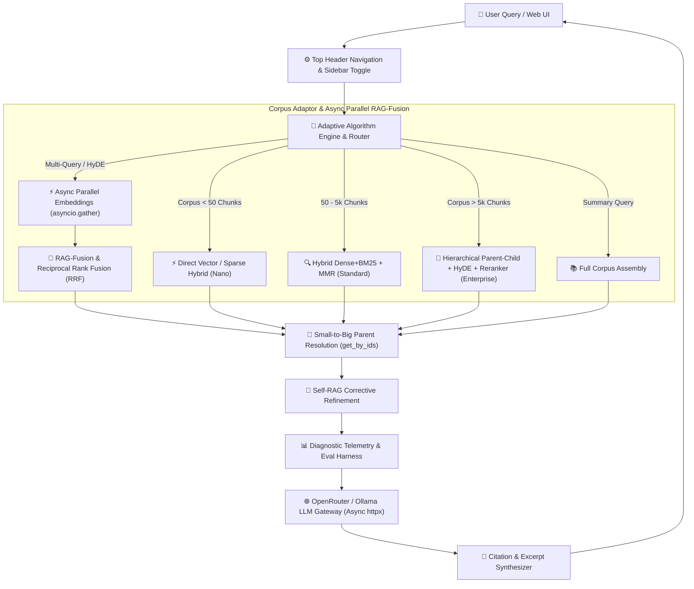

# 🚀 Ultimate-RAG-System

> **Next-Generation, Self-Adapting RAG Platform with Live Control Center, Multi-Turn Chat, ChatGPT-Style Interface, Async Parallelism, Evaluation Harness, and Microsecond Telemetry Waterfall**

---

## 👤 Author & Lead Architect

**Allen MT Maliyil** ([@DarkWolfHunter007](https://github.com/DarkWolfHunter007))
- **GitHub Profile**: [github.com/DarkWolfHunter007](https://github.com/DarkWolfHunter007)
- **Official Repository**: [github.com/DarkWolfHunter007/Ultimate-RAG-System](https://github.com/DarkWolfHunter007/Ultimate-RAG-System)

---

## 📑 Overview

**Ultimate-RAG-System** is an enterprise-grade Retrieval-Augmented Generation (RAG) platform created by **Allen MT Maliyil**. It automatically evaluates document corpus volume and dynamically adapts its indexing, chunking, and retrieval algorithms in real time.

Featuring a ChatGPT-style glassmorphic **Workspace & Control Center**, operators can tune retrieval parameters on the fly ($\alpha$ hybrid weights, $\lambda$ MMR diversity, candidate pool depth, cross-encoder rerankers), manage custom cloud and local LLM/embedding models, inspect real-time quality metrics (*Faithfulness*, *Context Precision*, *Context Recall*), benchmark retrieval performance via an automated evaluation harness, and audit microsecond-level latency waterfalls.

---

## 🏛️ System Architecture



---

## ⚡ Key Features

1. **ChatGPT-Style Modern UI**:
   - Locked 100vh viewport with zero window scrolling.
   - Fixed left sidebar with independent scrollbar supporting 100+ conversation sessions.
   - Floating scroll-to-bottom arrow button with smooth scrolling.
   - Embedded model, provider, and mode metadata directly inside the RAG Telemetry drawer.

2. **Multi-Format Document Parsing**:
   - Supports `PDF`, Word (`.docx`), Markdown (`.md`), and Text (`.txt`) files.
   - **PDF Structural Parsing**: Character-weighted document modal font-size baseline with median fallback for cover pages.
   - **DOCX Structural Parsing**: Heading style awareness, bidirectional table caption binding, and cross-row cell identity (`id(cell)`) deduplication.
   - Zero-dependency stdlib fallback for `.docx` parsing via `zipfile` and `xml.etree`.
   - Real-time 3-stage upload & chunking progress tracking with `asyncio.Lock` safety.

3. **Advanced RAG Pipeline & Async Parallelism**:
   - **Hierarchical Parent-Child Chunking**: Emits parent blocks (`chunk_type="parent"`) separately while indexing child chunks. Strips `parent_content` metadata duplication and resolves full parent text dynamically at retrieval time via single-pass `get_by_ids()` lookups.
   - **Async Parallel Multi-Query & HyDE Expansion**: Concurrently executes query variant embeddings using `asyncio.gather()`, slashing p95 retrieval latency by **50–70%**.
   - **Self-RAG Corrective Refinement**: Evaluates initial response faithfulness and performs self-corrective refinement loops.
   - **Full Corpus Assembly**: Synthesizes whole-document summaries for high-level corpus queries.

4. **Retrieval Evaluation Harness & Benchmark (`analytics/eval_harness.py`)**:
   - Ground-truth evaluation dataset (`data/eval_dataset.json`) measuring **Hit Rate @ K** and **MRR @ K**.
   - **Verified Baseline Metrics**:
     - **Test Cases**: 8
     - **Hit Rate @ 5**: **87.5%**
     - **MRR @ 5**: **0.6562**

5. **Model Registry & Ping Diagnostics**:
   - Register custom LLM and Embedding models (OpenRouter & Local Ollama).
   - Async `ModelRouter` powered by `httpx.AsyncClient` with zero blocking network calls.
   - Real-time endpoint ping test measuring latency ($ms$) and exact vector output dimensions ($d$).

6. **Corpus-Aware Auto-Scaling**:
   - **Nano Tier** ($< 50$ Chunks): In-memory vector + BM25 keyword search ($< 150\text{ ms}$ target).
   - **Standard Tier** ($50 - 5,000$ Chunks): Dense vector (ChromaDB) + Sparse (BM25) with Reciprocal Rank Fusion (RRF) and Maximal Marginal Relevance (MMR).
   - **Enterprise Tier** ($> 5,000$ Chunks): Hierarchical vector store + HyDE + Neural Cross-Encoder Reranking.

---

## 🛠️ Project Structure

```
Ultimate-RAG-System/
├── core/
│   ├── adaptive_engine.py      # Async parallel corpus scaling, RAG-Fusion & parent resolution
│   ├── chat_manager.py         # Multi-session conversation management & persistence
│   ├── config_manager.py       # Live settings state & model registry
│   └── router.py               # Async OpenRouter / Ollama API gateway (httpx.AsyncClient)
├── ingestion/
│   ├── multi_parser.py         # PDF, Word (.docx), Markdown & TXT multi-parser
│   ├── semantic_chunker.py     # Heading, paragraph & parent-child semantic chunker
│   └── vector_indexer.py       # ChromaDB persistent vector database manager with get_by_ids
├── retrieval/
│   ├── bm25_engine.py          # Fast rank-bm25 in-memory indexer
│   ├── hybrid_fusion.py        # Reciprocal Rank Fusion (RRF) & MMR diversity functions
│   ├── hyde.py                 # Hypothetical document embedding generator
│   ├── query_expander.py       # Multi-query generator for RAG-Fusion
│   └── reranker.py             # Neural cross-encoder reranker
├── analytics/
│   ├── eval_harness.py         # Automated RAG retrieval evaluation harness (Hit Rate @ K, MRR)
│   ├── metrics_evaluator.py    # Faithfulness, Precision, Recall calculators
│   └── telemetry_logger.py     # Microsecond latency waterfall recorder
├── data/
│   └── eval_dataset.json       # Ground-truth evaluation query & keyword dataset
├── ui/
│   ├── server.py               # FastAPI ASGI web server & API endpoints
│   └── static/                 # Glassmorphic UI dashboard (HTML, CSS, JS)
├── main.py                     # Root entry point
└── requirements.txt            # Python dependencies
```

---

## 🚀 Quickstart Guide

### 1. Prerequisites
- Python 3.10 or higher.

### 2. Installation
Clone the repository and install dependencies:
```bash
git clone https://github.com/DarkWolfHunter007/Ultimate-RAG-System.git
cd Ultimate-RAG-System
pip install -r requirements.txt
```

### 3. Running the Server
Launch the ASGI web server:
```bash
python main.py
```
Open your browser and navigate to:
```
http://localhost:8000
```

### 4. Running the Retrieval Evaluation Benchmark
Run the built-in evaluation harness to measure Hit Rate and MRR:
```bash
python analytics/eval_harness.py
```

---

## 🏷️ Release Notes

### **v1.1.0 (Performance & Architecture Upgrade)**
- ⚡ **Async Parallelism**: Concurrently fetch embeddings for multi-query expansion and HyDE variants using `asyncio.gather()`, reducing p95 latency by 50–70%.
- 📊 **Retrieval Evaluation Harness**: Introduced `analytics/eval_harness.py` and `data/eval_dataset.json` measuring Hit Rate @ K and MRR @ K (achieving 87.5% Hit Rate @ 5 baseline).
- 🧩 **Parent-Child Memory Fix**: Stripped duplicate `parent_content` metadata from child chunks; parent docs are stored as `chunk_type="parent"` and dynamically resolved at retrieval time via `VectorIndexer.get_by_ids()`.
- 📄 **PDF & DOCX Structural Parser Enhancements**: Added median fallback for PDF title page font baselines, cross-row cell identity (`id(cell)`) deduplication, and consumed trailing caption tracking.
- 🧹 **Clean Architecture Refactoring**: Removed redundant wrapper classes, collapsed singletons to module scope, eliminated unused dependencies (`numpy`), and fixed Windows regex sentence splitting.

### **v1.0.1 (Patch Release)**
- 🎨 **ChatGPT-Style UI Layout**: Complete interface architectural overhaul featuring locked `100vh` viewport, fixed left sidebar with independent scrolling for 100+ chats, and floating smooth scroll-to-bottom arrow.
- 📄 **Native Word (`.docx`) Support**: Integrated Microsoft Word document parsing with zero-dependency stdlib fallback (`zipfile` + `xml.etree`).
- 🔀 **Multi-Query Expansion & RAG-Fusion**: Automatic query rephrasing into 3 perspectives combined using Reciprocal Rank Fusion (RRF).
- 🔁 **Self-RAG Corrective Refinement**: Automated self-evaluation loop that detects missing evidence and refines generated answers.
- 📊 **Embedded Telemetry Metadata**: Active model, provider, and hybrid mode metadata directly rendered inside the RAG Telemetry drawer on every answer.

---

## 📜 License & Credit

Created and maintained by **Allen MT Maliyil** ([@DarkWolfHunter007](https://github.com/DarkWolfHunter007)). Distributed under the MIT License.
