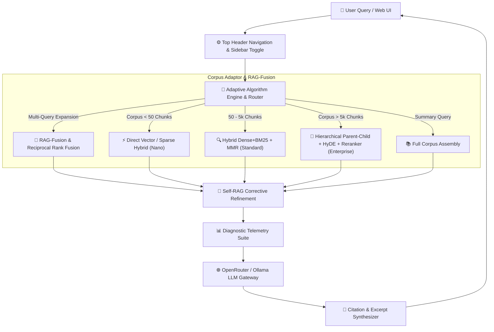

# 🚀 Ultimate-RAG-System

> **Next-Generation, Self-Adapting RAG Platform with Live Control Center, Multi-Turn Chat, ChatGPT-Style Interface, and Microsecond Telemetry Waterfall**

---

## 👤 Author & Lead Architect

**Allen MT Maliyil** ([@DarkWolfHunter007](https://github.com/DarkWolfHunter007))
- **GitHub Profile**: [github.com/DarkWolfHunter007](https://github.com/DarkWolfHunter007)
- **Official Repository**: [github.com/DarkWolfHunter007/Ultimate-RAG-System](https://github.com/DarkWolfHunter007/Ultimate-RAG-System)

---

## 📑 Overview

**Ultimate-RAG-System** is an enterprise-grade Retrieval-Augmented Generation (RAG) platform created by **Allen MT Maliyil**. It automatically evaluates document corpus volume and dynamically adapts its indexing, chunking, and retrieval algorithms in real time.

Featuring a ChatGPT-style glassmorphic **Workspace & Control Center**, operators can tune retrieval parameters on the fly ($\alpha$ hybrid weights, $\lambda$ MMR diversity, candidate pool depth, cross-encoder rerankers), manage custom cloud and local LLM/embedding models, inspect real-time quality metrics (*Faithfulness*, *Context Precision*, *Context Recall*), and audit microsecond-level latency waterfalls.

---

## 🏛️ System Architecture



---

## ⚡ Key Features

1. **ChatGPT-Style Modern UI**:
   - Locked 100vh viewport with zero window scrolling.
   - Fixed left sidebar with independent scrollbar supporting 100+ conversation sessions.
   - Floating scroll-to-bottom arrow button with smooth scrolling.
   - Embedded model, provider, and mode metadata directly inside the RAG Telemetry drawer.

2. **Multi-Format Document Parsing**:
   - Supports `PDF`, Word (`.docx`), Markdown (`.md`), and Text (`.txt`) files.
   - Zero-dependency stdlib fallback for `.docx` parsing via `zipfile` and `xml.etree`.
   - Real-time 3-stage upload & chunking progress tracking.

3. **Advanced RAG Pipeline Upgrades**:
   - **Hierarchical Parent-Child Chunking**: Retains parent context window for precise child vector matches.
   - **Multi-Query Expansion & RAG-Fusion**: Automatically expands queries into 3 alternative search perspectives with Reciprocal Rank Fusion (RRF).
   - **Self-RAG Corrective Refinement**: Evaluates initial response faithfulness and performs self-corrective refinement loops.
   - **Full Corpus Assembly**: Synthesizes whole-document summaries for high-level corpus queries.

4. **Model Registry & Ping Diagnostics**:
   - Register custom LLM and Embedding models (OpenRouter & Local Ollama).
   - Real-time endpoint ping test measuring latency ($ms$) and exact vector output dimensions ($d$).

5. **Corpus-Aware Auto-Scaling**:
   - **Nano Tier** ($< 50$ Chunks): In-memory vector + BM25 keyword search ($< 150\text{ ms}$ target).
   - **Standard Tier** ($50 - 5,000$ Chunks): Dense vector (ChromaDB) + Sparse (BM25) with Reciprocal Rank Fusion (RRF) and Maximal Marginal Relevance (MMR).
   - **Enterprise Tier** ($> 5,000$ Chunks): Hierarchical vector store + HyDE + Neural Cross-Encoder Reranking.

---

## 🛠️ Project Structure

```
Ultimate-RAG-System/
├── core/
│   ├── adaptive_engine.py      # Dynamic corpus scaling, RAG-Fusion, Self-RAG & pipeline routing
│   ├── chat_manager.py         # Multi-session conversation management & persistence
│   ├── config_manager.py       # Live settings state, model registry & JSON storage
│   └── router.py               # OpenRouter / Ollama API gateway with token safety guards
├── ingestion/
│   ├── multi_parser.py         # PDF, Word (.docx), Markdown & TXT multi-parser with stdlib fallback
│   ├── semantic_chunker.py     # Heading, paragraph & hierarchical parent-child semantic chunker
│   └── vector_indexer.py       # ChromaDB persistent vector database manager
├── retrieval/
│   ├── bm25_engine.py          # Fast rank-bm25 in-memory indexer
│   ├── hybrid_fusion.py        # Reciprocal Rank Fusion (RRF) & MMR diversity engine
│   ├── hyde.py                 # Hypothetical document embedding generator
│   ├── query_expander.py       # Multi-query generator for RAG-Fusion
│   └── reranker.py             # Neural cross-encoder bridge
├── analytics/
│   ├── metrics_evaluator.py    # Faithfulness, Precision, Recall calculators
│   └── telemetry_logger.py     # Microsecond latency waterfall recorder
├── ui/
│   ├── server.py               # FastAPI ASGI web server & API endpoints
│   └── static/                 # Glassmorphic UI dashboard (HTML, CSS, JS)
├── main.py                     # Root entry point
└── requirements.txt            # Python dependencies
```

---

## 🚀 Quickstart Guide

### 1. Prerequisites
- Python 3.10 or higher.

### 2. Installation
Clone the repository and install dependencies:
```bash
git clone https://github.com/DarkWolfHunter007/Ultimate-RAG-System.git
cd Ultimate-RAG-System
pip install -r requirements.txt
```

### 3. Running the Server
Launch the ASGI web server:
```bash
python main.py
```
Open your browser and navigate to:
```
http://localhost:8000
```

---

## 📜 License & Credit

Created and maintained by **Allen MT Maliyil** ([@DarkWolfHunter007](https://github.com/DarkWolfHunter007)). Distributed under the MIT License.
