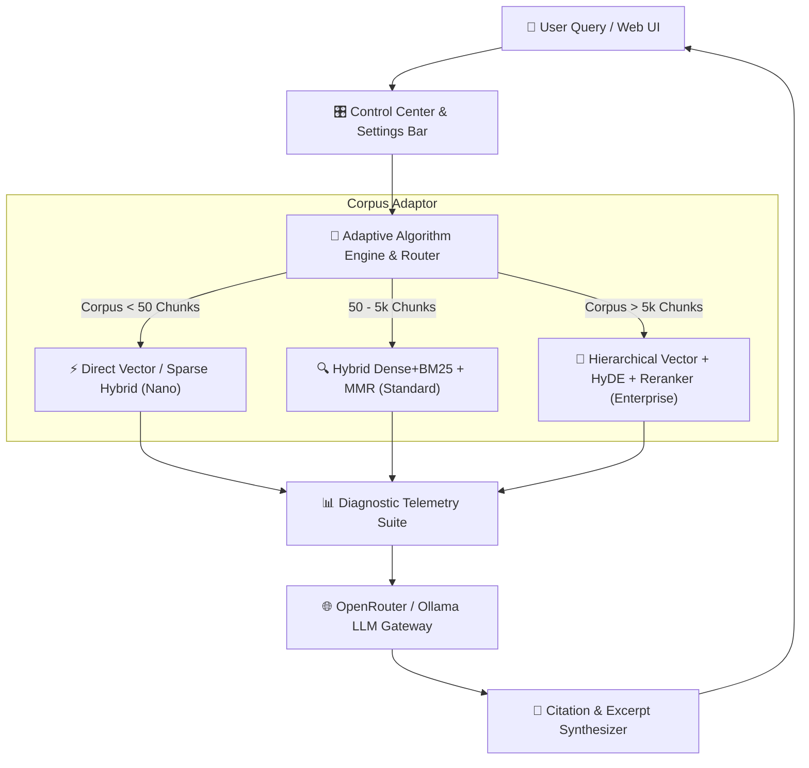

# 🚀 Ultimate-RAG-System

> **Next-Generation, Self-Adapting RAG Platform with Live Control Center & Microsecond Telemetry Waterfall**

---

## 📑 Overview

**Ultimate-RAG-System** is an enterprise-grade Retrieval-Augmented Generation (RAG) platform that automatically evaluates document corpus volume and dynamically adapts its indexing and retrieval algorithms in real time. 

Featuring an intuitive glassmorphic **Control Center & Live Settings Bar**, operators can tune retrieval parameters on the fly ($\alpha$ hybrid weights, $\lambda$ MMR diversity, candidates pool, rerankers), monitor real-time quality metrics (*Faithfulness*, *Context Precision*, *Context Recall*), and inspect microsecond-level latency waterfalls.

---

## 🏛️ System Architecture



---

## ⚡ Key Features

1. **Corpus-Aware Auto-Scaling**:
   - **Nano Tier** ($< 50$ Chunks): In-memory vector + BM25 keyword search ($< 150\text{ ms}$ latency target).
   - **Standard Tier** ($50 - 5,000$ Chunks): Dense vector (ChromaDB) + Sparse (BM25) with Reciprocal Rank Fusion (RRF) and Maximal Marginal Relevance (MMR).
   - **Enterprise Tier** ($> 5,000$ Chunks): Hierarchical vector store + HyDE (Hypothetical Document Embeddings) + Neural Cross-Encoder Reranking.
2. **OpenRouter & Ollama Gateway**: Switch seamlessly between cloud LLMs (`Gemini 2.0`, `Llama 3.3 70B`, `DeepSeek R1`) and local `Ollama` models without changing code.
3. **Live Control Center**: Glassmorphic UI with dynamic sliders for Hybrid Weight ($\alpha$), MMR Diversity ($\lambda$), candidate depth, and algorithm feature toggles.
4. **Real-Time Telemetry & Quality Metrics**: Inspect latency waterfalls and groundedness scores (*Faithfulness*, *Context Precision*, *Context Recall*) right inside the UI.

---

## 🛠️ Project Structure

```
Ultimate-RAG-System/
├── core/
│   ├── adaptive_engine.py      # Dynamic corpus scaling & algorithm routing
│   ├── config_manager.py       # Live settings state & environment validation
│   └── router.py               # OpenRouter / Ollama API client with fallback matrix
├── ingestion/
│   ├── multi_parser.py         # PyMuPDF, Markdown & TXT parser
│   ├── semantic_chunker.py     # Heading & paragraph-aware chunker
│   └── vector_indexer.py       # ChromaDB persistent vector database manager
├── retrieval/
│   ├── bm25_engine.py          # Fast rank-bm25 in-memory indexer
│   ├── hybrid_fusion.py        # Reciprocal Rank Fusion (RRF) & MMR diversity engine
│   ├── hyde.py                 # Hypothetical document embedding generator
│   └── reranker.py             # Neural cross-encoder bridge
├── analytics/
│   ├── metrics_evaluator.py    # Faithfulness, Precision, Recall calculators
│   └── telemetry_logger.py     # Microsecond latency waterfall recorder
├── ui/
│   ├── server.py               # FastAPI ASGI web server
│   └── static/                 # Glassmorphic UI dashboard (HTML, CSS, JS)
├── main.py                     # Root entry point
└── requirements.txt            # Python dependencies
```

---

## 🚀 Quickstart Guide

### 1. Prerequisites
- Python 3.10 or higher installed.

### 2. Installation
Clone the repository and install requirements:
```bash
pip install -r requirements.txt
```

### 3. Environment Setup (Optional)
Set your OpenRouter API Key (or configure Ollama in the UI):
```bash
# Windows PowerShell
$env:OPENROUTER_API_KEY="sk-or-v1-your-key-here"

# Linux / macOS
export OPENROUTER_API_KEY="sk-or-v1-your-key-here"
```

### 4. Running the Web Server
Launch the ASGI server:
```bash
python main.py
```
Open your browser and navigate to:
```
http://localhost:8000
```

---

## 📜 License

Distributed under the MIT License.
