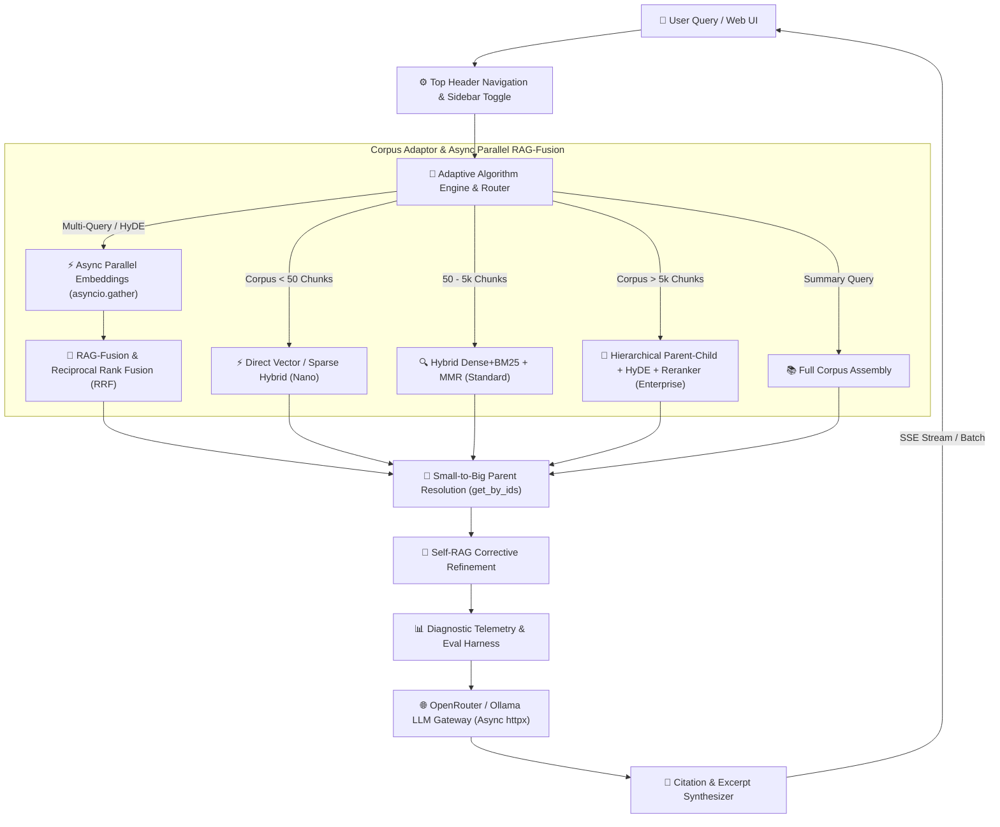

# 🚀 Ultimate-RAG-System

> **Next-Generation, Self-Adapting RAG Platform with Live Control Center, Multi-Turn Chat, ChatGPT-Style Interface, Async Parallelism, SSE Token Streaming, Evaluation Harness, and Microsecond Telemetry Waterfall**

---

## 👤 Author & Lead Architect

**Allen MT Maliyil** ([@DarkWolfHunter007](https://github.com/DarkWolfHunter007))
- **GitHub Profile**: [github.com/DarkWolfHunter007](https://github.com/DarkWolfHunter007)
- **Official Repository**: [github.com/DarkWolfHunter007/Ultimate-RAG-System](https://github.com/DarkWolfHunter007/Ultimate-RAG-System)

---

## 📑 Overview

**Ultimate-RAG-System** is an enterprise-grade Retrieval-Augmented Generation (RAG) platform created by **Allen MT Maliyil**. It automatically evaluates document corpus volume and dynamically adapts its indexing, chunking, and retrieval algorithms in real time.

Featuring a ChatGPT-style glassmorphic **Workspace & Control Center**, operators can tune retrieval parameters on the fly ($\alpha$ hybrid weights, $\lambda$ MMR diversity, candidate pool depth, cross-encoder rerankers), manage custom cloud and local LLM/embedding models, inspect real-time quality metrics (*Faithfulness*, *Context Precision*, *Context Recall*), benchmark retrieval performance via an automated evaluation harness, and audit microsecond-level latency waterfalls.

---

## 🏛️ System Architecture



---

## ⚡ Key Features

1. **ChatGPT-Style Modern UI**:
   - Locked 100vh viewport with zero window scrolling.
   - Fixed left sidebar with independent scrollbar supporting 100+ conversation sessions.
   - Floating scroll-to-bottom arrow button with smooth scrolling.
   - Embedded model, provider, and mode metadata directly inside the RAG Telemetry drawer.
   - **ChatGPT-style word-by-word SSE token streaming** via `/api/query/stream`.

2. **Multi-Format Document Parsing**:
   - Supports `PDF`, Word (`.docx`), Markdown (`.md`), and Text (`.txt`) files.
   - **PDF Structural Parsing**: Character-weighted document modal font-size baseline with median fallback for cover pages. Newline-joined lines preserve list items, Markdown tables, and paragraph structure.
   - **DOCX Structural Parsing**: Heading style awareness, bidirectional table caption binding, and cross-row cell identity (`id(cell)`) deduplication.
   - Zero-dependency stdlib fallback for `.docx` parsing via `zipfile` and `xml.etree`.
   - Real-time 3-stage upload & chunking progress tracking with `asyncio.Lock` safety.

3. **Advanced RAG Pipeline & Async Parallelism**:
   - **Hierarchical Parent-Child Chunking**: Emits parent blocks (`chunk_type="parent"`) separately while indexing child chunks. Strips `parent_content` metadata duplication and resolves full parent text dynamically at retrieval time via single-pass `get_by_ids()` lookups.
   - **Structural Boundary Detection**: Splits on Markdown headings (`#`/`##`/`###`), fenced code blocks, and table rows to preserve document structure within chunks.
   - **Sliding Window Sentence Overlap**: Carries 2 trailing sentences from the previous chunk into the next for context continuity.
   - **Automatic Breadcrumb Prepending**: Prepends `[Context: Heading Path]` to every child chunk for grounded retrieval.
   - **Async Parallel Multi-Query & HyDE Expansion**: Concurrently executes query variant embeddings using `asyncio.gather()`, slashing p95 retrieval latency by **50–70%**.
   - **Self-RAG Corrective Refinement**: Evaluates initial response faithfulness and performs self-corrective refinement loops.
   - **Full Corpus Assembly**: Synthesizes whole-document summaries for high-level corpus queries.

4. **Real-Time SSE Token Streaming**:
   - `/api/query/stream` endpoint delivers word-by-word tokens using `StreamingResponse` and Server-Sent Events (SSE).
   - Powered by `execute_rag_stream()` in `AdaptiveEngine` — full RAG context preparation + async token streaming via `ModelRouter`.
   - Zero breaking change to existing `/api/query` batch endpoint.

5. **Retrieval Evaluation Harness & Benchmark (`tests/eval_harness.py`)**:
   - Ground-truth evaluation dataset (`data/eval_dataset.json`) measuring **Hit Rate @ K** and **MRR @ K**.
   - Synthetic QA dataset generator (`tests/dataset_generator.py`) using LLM to auto-generate ground-truth Q&A pairs per chunk (Prajwal BM method).
   - Zero-dependency `unittest` suite (`tests/test_pipeline.py`) covering parse → chunk → BM25 → RRF pipeline.
   - **Verified Baseline Metrics**:
     - **Test Cases**: 8
     - **Hit Rate @ 5**: **87.5%**
     - **MRR @ 5**: **0.6562**

6. **Model Registry & Ping Diagnostics**:
   - Register custom LLM and Embedding models (OpenRouter & Local Ollama).
   - Async `ModelRouter` powered by `httpx.AsyncClient` with zero blocking network calls.
   - Real-time endpoint ping test measuring latency ($ms$) and exact vector output dimensions ($d$).

7. **Corpus-Aware Auto-Scaling**:
   - **Nano Tier** ($< 50$ Chunks): In-memory vector + BM25 keyword search ($< 150\text{ ms}$ target).
   - **Standard Tier** ($50 - 5,000$ Chunks): Dense vector (ChromaDB) + Sparse (BM25) with Reciprocal Rank Fusion (RRF) and Maximal Marginal Relevance (MMR).
   - **Enterprise Tier** ($> 5,000$ Chunks): Hierarchical vector store + HyDE + Neural Cross-Encoder Reranking.

---

## 🛠️ Project Structure

```
Ultimate-RAG-System/
├── core/
│   ├── adaptive_engine.py      # Async parallel corpus scaling, RAG-Fusion, SSE streaming
│   ├── chat_manager.py         # Multi-session conversation management & persistence
│   ├── config_manager.py       # Live settings state & model registry
│   └── router.py               # Async OpenRouter / Ollama API gateway (httpx.AsyncClient)
├── ingestion/
│   ├── multi_parser.py         # PDF, Word (.docx), Markdown & TXT multi-parser
│   ├── semantic_chunker.py     # Structural boundary + sliding window parent-child chunker
│   └── vector_indexer.py       # ChromaDB persistent vector database manager with get_by_ids
├── retrieval/
│   ├── bm25_engine.py          # Fast rank-bm25 in-memory indexer (token-overlap fallback)
│   ├── hybrid_fusion.py        # RRF + n-gram MMR diversity functions
│   ├── hyde.py                 # Hypothetical document embedding generator
│   ├── query_expander.py       # Multi-query generator for RAG-Fusion
│   └── reranker.py             # Neural cross-encoder reranker (lazy-loaded)
├── analytics/
│   ├── metrics_evaluator.py    # Faithfulness, Precision, Recall calculators
│   └── telemetry_logger.py     # Microsecond latency waterfall recorder
├── tests/
│   ├── eval_harness.py         # Automated RAG retrieval evaluation harness (Hit Rate @ K, MRR)
│   ├── dataset_generator.py    # Synthetic QA eval dataset generator (Prajwal BM method)
│   └── test_pipeline.py        # Zero-dependency unittest suite (parse → chunk → BM25 → RRF)
├── data/
│   └── eval_dataset.json       # Ground-truth evaluation query & keyword dataset
├── ui/
│   ├── server.py               # FastAPI ASGI web server & API endpoints (incl. SSE stream)
│   └── static/                 # Glassmorphic UI dashboard (HTML, CSS, JS)
├── main.py                     # Root entry point
└── requirements.txt            # Python dependencies
```

---

## 🚀 Quickstart Guide

### 1. Prerequisites
- Python 3.10 or higher.

### 2. Installation
Clone the repository and install dependencies:
```bash
git clone https://github.com/DarkWolfHunter007/Ultimate-RAG-System.git
cd Ultimate-RAG-System
pip install -r requirements.txt
```

### 3. Running the Server
Launch the ASGI web server:
```bash
python main.py
```
Open your browser and navigate to:
```
http://localhost:8000
```

### 4. Running the Test Suite
Run the zero-dependency unittest suite:
```bash
python tests/test_pipeline.py
```

### 5. Running the Retrieval Evaluation Benchmark
Run the built-in evaluation harness to measure Hit Rate and MRR:
```bash
python tests/eval_harness.py
```

### 6. Generating a Synthetic Evaluation Dataset
Auto-generate ground-truth Q&A pairs from your indexed corpus:
```bash
python tests/dataset_generator.py
```

---

## 🏷️ Release Notes

### **v1.4.0 — Async SSE Token Streaming**
- 🌊 **Word-by-Word Token Streaming**: Added `/api/query/stream` SSE endpoint delivering real-time tokens as they are generated, powered by `execute_rag_stream()` in `AdaptiveEngine`.
- ⚡ **`execute_rag_stream()`**: Extracts shared `_prepare_rag_context()` helper to eliminate code duplication between batch and streaming pipelines.
- 🔌 **`stream_completion()` in ModelRouter**: Async generator method streaming raw token chunks from OpenRouter and Ollama providers.
- ✅ Zero breaking change to the existing `/api/query` batch endpoint.

### **v1.3.0 — Document Structure & PDF Layout Preservation**
- 📄 **Newline PDF Line Joining**: Changed PDF line assembly from space-join to newline-join, preserving bullet lists, Markdown tables, and paragraph breaks in parsed output.
- 🧩 **List Block Preservation**: Semantic chunker now treats bulleted/dashed list blocks as unbreakable units — no mid-list sentence splits.
- 🔤 **Upgraded Sentence Splitter Regex**: Avoids splitting on decimal numbers (e.g. `3.14`), section titles, and known abbreviations (`Mr.`, `Dr.`, `vs.`).

### **v1.2.0 — Dev Test Suite Isolation**
- 🧪 **Eval Harness Relocated**: `eval_harness.py` moved from `analytics/` → `tests/` to fully isolate the testing suite from the production runtime — zero core dependencies on `tests/`.
- 🤖 **Synthetic Dataset Generator**: Added `tests/dataset_generator.py` — uses `ModelRouter` to auto-generate ground-truth Q&A pairs per chunk (Prajwal BM method).
- ✅ **Unittest Suite**: Added `tests/test_pipeline.py` — stdlib `unittest` coverage for parse → chunk → BM25 → RRF pipeline.
- 🔧 **sys.path Bootstrapping**: All test scripts self-resolve the project root, so they can be invoked directly from inside `tests/`.

### **v1.1.0 — Chunking & Semantic Search Upgrade**
- 🏗️ **Structural Boundary Splitting**: Chunks now split on Markdown headings (`#`/`##`/`###`), fenced code blocks, and table rows to preserve document structure.
- 🔗 **Sliding Window Overlap**: Carries 2 trailing sentences across chunk boundaries for retrieval context continuity.
- 🏷️ **Breadcrumb Context Prepending**: Every child chunk is prefixed with `[Context: Heading Path]` for grounded retrieval.
- 🎯 **Vector Similarity Thresholding**: Filters out low-confidence vector results below `0.15` cosine similarity before RRF fusion.
- 📐 **N-gram MMR + RRF Score Boosting**: MMR diversity now uses subword character 3-gram + word token overlap; RRF fusion additionally boosts by raw vector similarity score.

### **v1.0.1 (Patch Release)**
- 🎨 **ChatGPT-Style UI Layout**: Complete interface architectural overhaul featuring locked `100vh` viewport, fixed left sidebar with independent scrolling for 100+ chats, and floating smooth scroll-to-bottom arrow.
- 📄 **Native Word (`.docx`) Support**: Integrated Microsoft Word document parsing with zero-dependency stdlib fallback (`zipfile` + `xml.etree`).
- 🔀 **Multi-Query Expansion & RAG-Fusion**: Automatic query rephrasing into 3 perspectives combined using Reciprocal Rank Fusion (RRF).
- 🔁 **Self-RAG Corrective Refinement**: Automated self-evaluation loop that detects missing evidence and refines generated answers.
- 📊 **Embedded Telemetry Metadata**: Active model, provider, and hybrid mode metadata directly rendered inside the RAG Telemetry drawer on every answer.

### **v1.0.0 — Ponytail Architecture Sweep**
- 🧹 **Dead Code Removal**: Deleted zero-caller aliases, no-op wrappers, and speculative abstractions across all core modules.
- 🐍 **Native Typing Modernisation**: Replaced `Dict`, `List`, `Tuple` typing imports with Python 3.9+ built-in `dict[]`, `list[]` generics throughout the codebase.
- 🔧 **Helper Extraction**: Extracted `_openrouter_headers()` in `ModelRouter` and `_emit_child`/`_emit_parent` closures in `SemanticChunker` to eliminate duplicated dict construction.
- ⚙️ **FastAPI Lifespan Migration**: Replaced deprecated `@app.on_event('startup')` with the modern `asynccontextmanager` lifespan handler.

---

## 📜 License & Credit

Created and maintained by **Allen MT Maliyil** ([@DarkWolfHunter007](https://github.com/DarkWolfHunter007)). Distributed under the MIT License.
