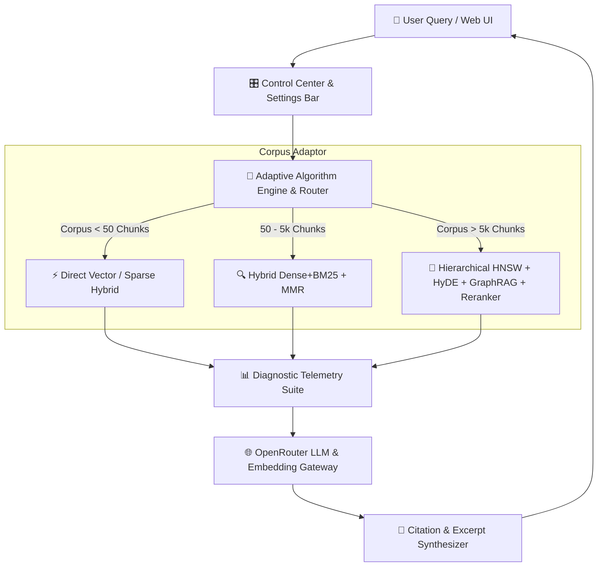
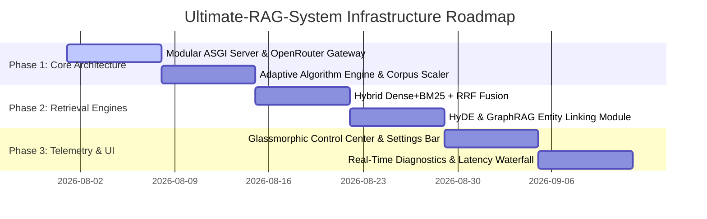

# 🚀 Product Requirement Document (PRD): Ultimate-RAG-System

> **Document Version**: 1.0.0  
> **Status**: Architecture Blueprint & Infrastructure Specification  
> **Target Scope**: Enterprise-Grade Adaptive Retrieval-Augmented Generation Platform  

---

## 📑 Executive Summary

The **Ultimate-RAG-System** is a next-generation, high-performance, self-adapting Retrieval-Augmented Generation (RAG) platform designed for dynamic document scaling, multi-modal ingestion, and complete operational transparency. Unlike static RAG implementations, this system automatically evaluates the size and complexity of the ingested document corpus to adapt its underlying indexing and retrieval algorithms in real time. 

Powered by a unified **OpenRouter API** abstraction layer, the platform features a comprehensive **Control Center & Live Settings Bar** allowing operators to tune retrieval parameters on the fly, run real-time diagnostic benchmarks (NDCG, Faithfulness, Context Recall), and inspect microsecond-level latency waterfalls.

---

## 🏛️ System Architecture Overview



---

## ⚡ 1. Adaptive Algorithm Engine (Corpus-Aware Auto-Scaling)

The system automatically measures document volume, vocabulary entropy, and chunk count to dynamically select and optimize retrieval algorithms:

| Corpus Scale | Size Range | Primary Search Engine | Secondary Strategy | Reranking Engine | Target Latency |
| :--- | :--- | :--- | :--- | :--- | :--- |
| **Nano** | $< 50$ Chunks | In-Memory Cosine Similarity | Direct TF-IDF Keyword Matching | Bypassed (Zero Latency) | $< 150\text{ ms}$ |
| **Standard** | $50 - 5,000$ Chunks | Hybrid Dense (Embedding) + Sparse (BM25) | Maximal Marginal Relevance (MMR) | Light Cross-Encoder | $500 - 1,200\text{ ms}$ |
| **Enterprise** | $> 5,000$ Chunks | Hierarchical HNSW Vector Store + GraphRAG | HyDE (Hypothetical Document Embeddings) | ColBERT / Cohere v3 Rerank | $1.2 - 2.5\text{ s}$ |

### 1.1 Dynamic Algorithm Switches
- **HyDE (Hypothetical Document Embeddings)**: Generates a synthetic draft response via OpenRouter first, then searches vectors using the draft embedding. Auto-enables when queries are abstract or conceptual.
- **GraphRAG Entity Linker**: Constructs a light knowledge graph of extracted entities (standards, clauses, numbers) to resolve cross-document references.
- **Contextual Compression & Truncation**: Automatically trims redundant tokens from retrieved chunks using sentence-level relevance scoring before calling OpenRouter.

---

## 🎛️ 2. Dynamic Control Center & Live Settings Bar

The UI features a glassmorphic sidebar and sliding Settings Bar exposing full control over internal RAG mechanics:

### 2.1 Retrieval Tuning Controls
- **Hybrid Weight Slider ($\alpha$)**: Adjust ratio between Dense Semantic Search ($\alpha=1.0$) and BM25 Exact Keyword Match ($\alpha=0.0$). Default: $0.5$.
- **MMR Diversity Slider ($\lambda$)**: Balance relevance ($\lambda=1.0$) against chunk diversity ($\lambda=0.0$) to eliminate duplicate excerpts.
- **Top-$K$ Vector Candidate Selector**: Configurable candidate pool ($K_{vec} = 10 \text{ to } 100$).
- **Top-$N$ Final Context Selector**: Number of chunks passed to the LLM ($N_{final} = 3 \text{ to } 15$).

### 2.2 Algorithm Toggles
- `[ON/OFF]` **Cross-Encoder Reranker**: Toggle GPU/CPU neural reranking on candidate chunks.
- `[ON/OFF]` **HyDE Synthesis**: Toggle hypothetical document embedding generation.
- `[ON/OFF]` **GraphRAG Linking**: Enable entity-relation graph traversal for multi-hop questions.
- `[ON/OFF]` **OCR & Vision Pipeline**: Toggle local RapidOCR / OpenRouter Vision for figures & schematics.
- `[ON/OFF]` **Strict Evidence Enforcement**: Reject out-of-context hallucinations when evidence is below confidence threshold.

### 2.3 OpenRouter Model Gateway & Multi-Model Router
- **LLM Tier Selector**:
  - ⚡ *Fast Tier*: `inclusionai/ling-3.0-flash:free` / `google/gemini-2.0-flash-lite-001` (Instant Q&A)
  - 🧠 *Reasoning Tier*: `deepseek/deepseek-r1:free` / `meta-llama/llama-3.3-70b-instruct` (Complex Analysis)
  - 👁️ *Vision Tier*: `google/gemini-2.0-flash-001` (Diagrams & Tables)
- **Embedding Model Selector**:
  - `nvidia/nemotron-3-embed-1b:free`
  - `text-embedding-3-small` / `baai/bge-large-en-v1.5`

---

## 🔬 3. Real-Time Diagnostics & Telemetry Suite

Every query execution outputs a detailed **Diagnostic Drawer** for complete developer & auditor visibility:

```
┌─────────────────────────────────────────────────────────────────────────────┐
│ 🔬 DIAGNOSTIC BREAKDOWN FOR QUERY #1042                                     │
├─────────────────────────────────────────────────────────────────────────────┤
│ ⏱️ LATENCY WATERFALL                                                        │
│ ├── Query Vector Encoding:       42 ms  [██░░░░░░░░]                         │
│ ├── BM25 Keyword Search:         8 ms   [█░░░░░░░░░]                         │
│ ├── Hybrid Reciprocal Rank Fusion:4 ms   [█░░░░░░░░░]                         │
│ ├── Cross-Encoder Neural Rerank: 180 ms [█████░░░░░]                         │
│ └── OpenRouter LLM TTFT:         610 ms [██████████]                         │
│ TOTAL LATENCY:                   844 ms                                     │
├─────────────────────────────────────────────────────────────────────────────┤
│ 📊 RAG EVALUATION METRICS                                                   │
│ ├── Faithfulness Score:          0.96 / 1.00 (High Groundedness)            │
│ ├── Context Precision @ 5:        0.91 / 1.00                                │
│ ├── Context Recall:              0.88 / 1.00                                │
│ └── Estimated Query Cost:        $0.00000 (Free Tier Model)                 │
└─────────────────────────────────────────────────────────────────────────────┘
```

### 3.1 Ground Truth & Quality Inspection
- **Interactive Citation Linkage**: Every sentence cited is linked to numerical badges `[1]`, `[2]`.
- **Inline PDF Highlighting & Dual View**: Click citation to open embedded PDF viewer with exact bounding box or page anchor `#page=N`.
- **Raw Chunk Diff Inspector**: Compare raw stored text vs. cleaned text vs. LLM prompt context payload.

---

## 🏗️ 4. Infrastructure & Technology Stack Blueprint

### 4.1 System Components & Modules

```
Ultimate-RAG-System/
├── core/
│   ├── adaptive_engine.py      # Dynamic corpus scaling & algorithm routing
│   ├── config_manager.py       # Live settings state & environment validation
│   └── router.py               # OpenRouter API client with fallback retry matrix
├── ingestion/
│   ├── multi_parser.py         # PyMuPDF, Unstructured, PDF.js & RapidOCR
│   ├── semantic_chunker.py     # Heading, paragraph & token-aware chunker
│   └── vector_indexer.py       # ChromaDB / Qdrant HNSW vector store manager
├── retrieval/
│   ├── bm25_engine.py          # Fast rank-bm25 in-memory indexer
│   ├── hybrid_fusion.py        # Reciprocal Rank Fusion (RRF) & score normalizer
│   ├── hyde.py                 # Hypothetical document embedding generator
│   └── reranker.py             # Neural cross-encoder & Cohere API bridge
├── analytics/
│   ├── metrics_evaluator.py    # Faithfulness, Precision, Recall calculators
│   └── telemetry_logger.py     # Microsecond latency waterfall recorder
└── ui/
    ├── server.py               # High-concurrency ASGI / Python HTTP web server
    └── static/                 # Glassmorphic dashboard with live settings drawer
```

### 4.2 Database & Persistence Blueprint
- **Vector Database**: ChromaDB (Embedded / Persistent Cosine HNSW Index) with seamless upgrade path to Qdrant.
- **Full-Text Index**: Local rank-bm25 index cached in-memory with incremental updates.
- **Analytics & Log Store**: SQLite / DuckDB tracking query telemetry, token usage, and latency metrics.

---

## 🗺️ 5. Implementation Roadmap



---

## 💡 Key Differentiators of Ultimate-RAG-System

1. **Zero Over-Engineering for Small Corpora**: Automatically downgrades to light BM25/Cosine search when document count is low, saving CPU cycles and reducing latency to $<150\text{ ms}$.
2. **OpenRouter Multi-Provider Flexibility**: Instantly switch between Llama-3, Gemini 2.0, DeepSeek R1, or Qwen models without changing a single line of application logic.
3. **Transparent Telemetry**: Complete visibility into exact retrieval scores, context precision, and latency waterfalls right inside the UI.
4. **Interactive PDF Page Anchors**: Direct bounding-box and page-anchor navigation when clicking citations.
